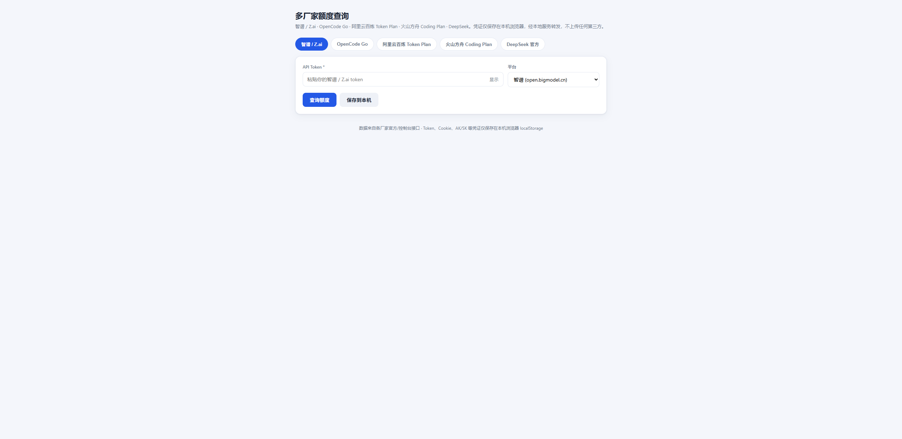
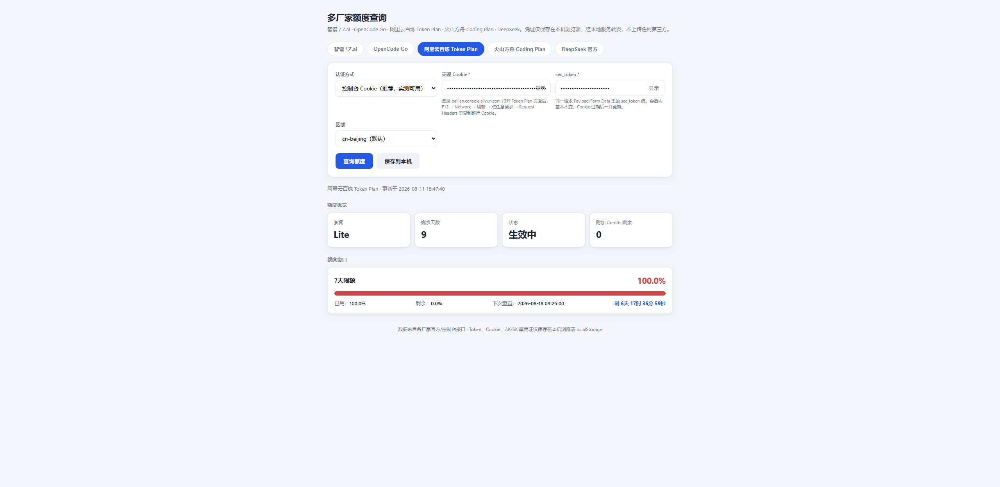

# 多厂家额度查询工具

一个**零依赖**的本地 Web 工具，用一个界面同时查询 5 家厂商的 AI 套餐额度/用量：智谱、OpenCode Go、阿里云百炼 Token Plan、火山方舟 Coding Plan、DeepSeek 官方。

无需 `npm install`，无需构建，`node` 直接跑。



## ✨ 功能

- **顶部 Tab 切换 5 家厂商**，各自独立凭证、独立保存
- **统一结果渲染**：KPI 卡片 + 配额进度条 + 重置倒计时 + 明细表
- **凭证只存本机浏览器**（localStorage），经本地服务转发，**不上传任何第三方**
- 凭证按厂商分别记忆，切 Tab 不丢查询结果



## 🚀 快速开始

```bash
node app.mjs
```

或双击 `启动.bat`（自动打开浏览器 http://127.0.0.1:7788）。关闭终端即停止。

## 🏭 支持的厂商

| 厂商 | 认证方式 | 查询内容 |
|---|---|---|
| **智谱 / Z.ai** | API Token | 模型/工具用量（近 24h）+ 5小时/周/月配额与重置时间 |
| **OpenCode Go** | auth Cookie | Rolling/Weekly/Monthly 三个额度窗口 |
| **阿里云百炼 Token Plan** | 控制台 Cookie + sec_token | 套餐信息、7天限额用量与重置时间、附加 Credits |
| **火山方舟 Coding Plan** | AccessKey ID/Secret（火山签名 V4） | Agent Plan / Coding Plan 额度（5h/周/月） |
| **DeepSeek 官方** | API Key | 账户余额（充值/赠送/可用） |

## 📖 各厂商配置说明

### 智谱 / Z.ai
填入 `open.bigmodel.cn` 或 `api.z.ai` 的 API Token，可选平台。

### OpenCode Go
登录 opencode.ai 后复制 Cookie（或仅 `auth=` 的值），工作区 ID 可留空自动解析。

### 阿里云百炼 Token Plan（个人版）
1. 登录 [百炼控制台](https://bailian.console.aliyun.com) → Token Plan 页面
2. `F12` → Network → 刷新 → 点任意请求
3. 复制 **Request Headers 里的整行 Cookie** + **Payload 里的 sec_token**
4. 填入工具即可。凭证会话内稳定，过期后重新复制。

> 注：个人版 Token Plan 的用量只能通过控制台会话查询（官方管理 API 与 API Key 网关均不返回用量）。

### 火山方舟 Coding Plan
填写火山引擎账号的 AccessKey ID/Secret（与推理 API Key 是两套凭据，需 Ark 用量查询权限），自动先查 Agent Plan 再回落 Coding Plan。

### DeepSeek 官方
填入 DeepSeek 开放平台创建的 API Key。

## 🏗️ 技术架构

```
app.mjs          Node.js 原生 http 服务（零依赖）
├─ GET  /api/providers   各厂商表单元数据，前端动态渲染
└─ POST /api/query       { provider, credentials } → 统一结果

providers/       每家厂商一个模块，统一契约 { id, name, fields, query }
├─ index.mjs      注册表
├─ zhipu.mjs      智谱 monitor/usage 三接口
├─ opencode.mjs   抓取 opencode.ai 页面 HTML 解析
├─ bailian.mjs    百炼控制台网关（Cookie + sec_token）
├─ volcano.mjs    火山签名 V4 + 控制面 OpenAPI
├─ deepseek.mjs   余额接口
└─ util.mjs       共享 HTTP 工具

index.html       单页前端，无框架无外部依赖
```

新增厂商：在 `providers/` 加一个模块并在 `index.mjs` 注册，前端自动出现新 Tab，无需改其他代码。

## 🔒 安全说明

- 所有凭证（Token/Cookie/AK/SK）**仅保存在本机浏览器 localStorage**，服务端不落盘、不上传第三方。
- 服务只绑定 `127.0.0.1:7788`，仅本机可访问。
- 源码不含任何真实凭证。

## ⚠️ 已知限制

- opencodego / 火山方舟 / 百炼依赖上游页面结构或控制台接口，厂商改动可能失效（需更新适配）。
- 百炼个人版额度依赖控制台登录会话，Cookie 过期后需重新复制。

## 📄 License

MIT
